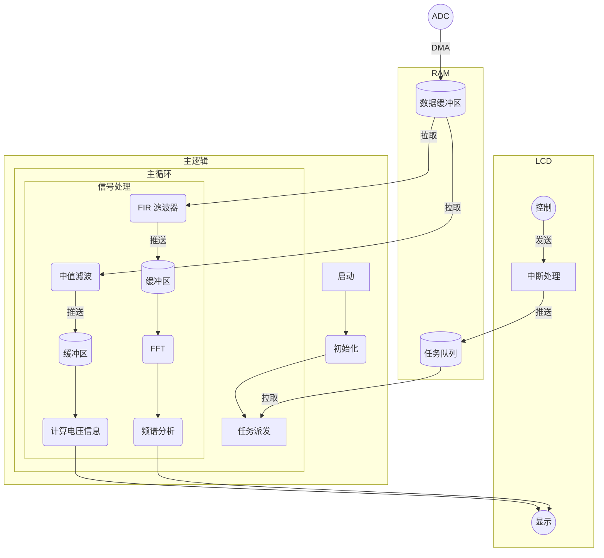
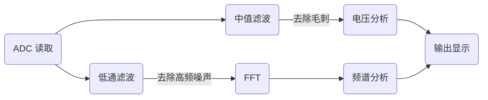

## abstract

```mermaid
flowchart TD
    subgraph "RAM"
        task_queue[("任务队列")]
        buffer[("数据缓冲区")]
    end

    handler["中断处理"] --"推送"--> task_queue

    subgraph "LCD"
        command(("控制"))
        command --"发送"--> handler

        display(("显示"))
    end

    subgraph "主逻辑"
        start["启动"]
        init("初始化")

        start --> init
        init --> dispatch

        subgraph "主循环"
            dispatch["任务派发"]
            task_queue --"拉取"--> dispatch

            subgraph "信号处理"
                median("中值滤波")
                med_buf[("缓冲区")]
                fir_buf[("缓冲区")]
                fir("FIR 滤波器")
                voltage("计算电压信息")
                fft("FFT")
                spectrum("频谱分析")

                buffer --"拉取"--> median
                buffer --"拉取"--> fir
                median --"推送"--> med_buf
                fir --"推送"--> fir_buf
                med_buf --> voltage
                fir_buf --> fft
                fft --> spectrum
                
                voltage --> display
                spectrum --> display
            end
        end
    end

    adc(("ADC")) --"DMA"--> buffer
```

## main procedure

```mermaid
flowchart LR
    adc("ADC 读取")
    median("中值滤波")
    lowpass("低通滤波")
    fft("FFT")

    voltage("电压分析")
    spectrum("频谱分析")

    output("输出显示")

    adc --> median -->|去除毛刺| voltage --> output

    adc --> lowpass --> |去除高频噪声| fft --> spectrum --> output
```

## signal

```mermaid
flowchart LR
    signal("过滤后信号")
    window("Blackman 窗")
    fft("FFT")
    spectrum("频谱")

    signal --> window --> fft --> spectrum
```