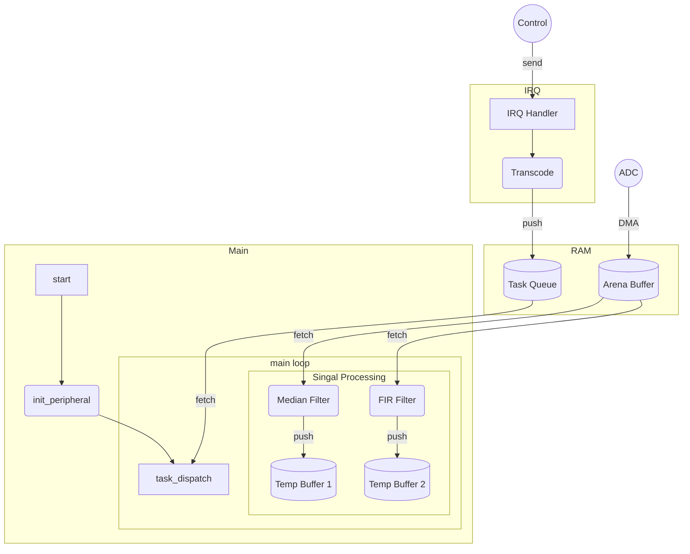

```mermaid
flowchart TD
    subgraph "RAM"
        task_queue[("Task Queue")]
        buffer[("Arena Buffer")]
    end

    subgraph "IRQ"
        handler["IRQ Handler"]
        transcode("Transcode")

        handler --> transcode
        transcode --"push"--> task_queue
    end

    command(("Control"))
    command --"send"--> handler

    subgraph "Main"
        start["start"]
        init("init_peripheral")

        start --> init
        init --> dispatch

        subgraph "main loop"
            dispatch["task_dispatch"]
            task_queue --"fetch"--> dispatch

            subgraph "Singal Processing"
                median("Median Filter")
                med_buf[("Temp Buffer 1")]
                fir_buf[("Temp Buffer 2")]
                fir("FIR Filter")

                buffer --"fetch"--> median
                buffer --"fetch"--> fir
                median --"push"--> med_buf
                fir --"push"--> fir_buf
            end
        end
    end

    adc(("ADC")) --"DMA"--> buffer
```
