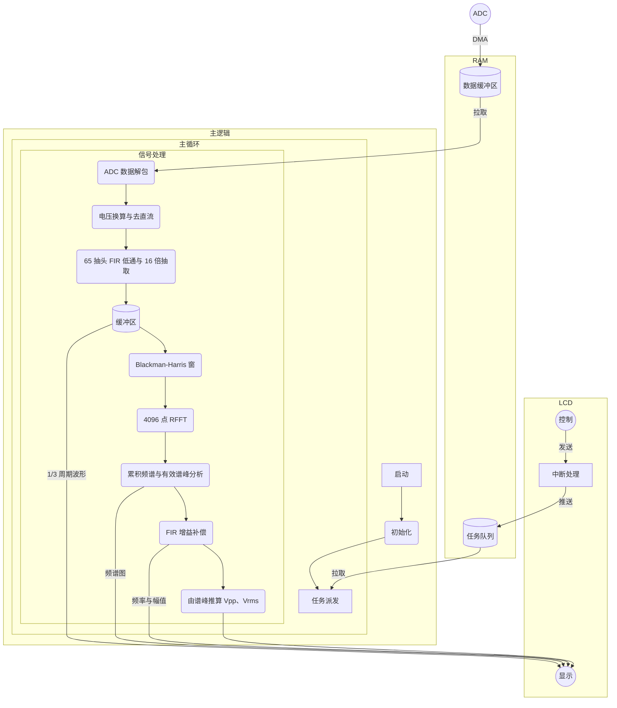
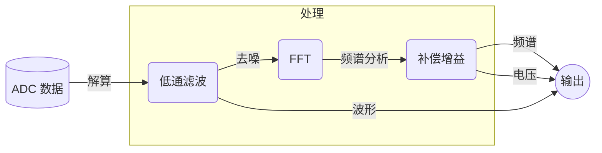
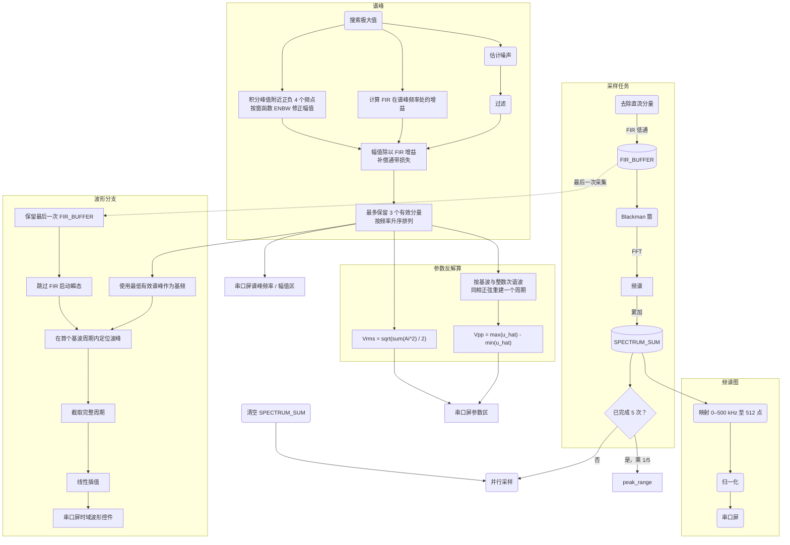
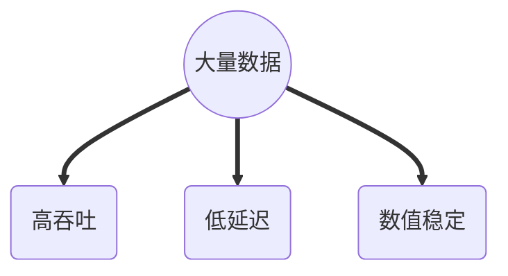

## abstract

```mermaid
flowchart TD
    subgraph "RAM"
        task_queue[("任务队列")]
        buffer[("数据缓冲区")]
    end

    handler["中断处理"] --"推送"--> task_queue

    subgraph "LCD"
        command(("控制"))
        command --"发送"--> handler

        display(("显示"))
    end

    subgraph "主逻辑"
        start["启动"]
        init("初始化")

        start --> init
        init --> dispatch

        subgraph "主循环"
            dispatch["任务派发"]
            task_queue --"拉取"--> dispatch

            subgraph "信号处理"
                unpack("ADC 数据解包")
                dc("电压换算与去直流")
                fir("65 抽头 FIR 低通与 16 倍抽取")
                fir_buf[("缓冲区")]
                window("Blackman-Harris 窗")
                fft("4096 点 RFFT")
                spectrum("累积频谱与有效谱峰分析")
                compensate("FIR 增益补偿")
                voltage("由谱峰推算 Vpp、Vrms")

                buffer --"拉取"--> unpack
                unpack --> dc --> fir --> fir_buf
                fir_buf --> window --> fft --> spectrum --> compensate

                fir_buf --"1/3 周期波形"--> display
                spectrum --"频谱图"--> display
                compensate --"频率与幅值"--> display
                compensate --> voltage --> display
            end
        end
    end

    adc(("ADC")) --"DMA"--> buffer
```

## main procedure

```mermaid
flowchart LR
    adc[("ADC 数据")]

    subgraph "处理"
        lowpass("低通滤波")
        fft("FFT")
        compensate("补偿增益")
    end

    output(("输出"))

    adc --> |解算| lowpass --> |去噪| fft --> |频谱分析| compensate --> |频谱| output
    lowpass --> |波形| output
    compensate --> |电压| output
```

## signal processing

```mermaid
flowchart TD
    adc("并行采样")
    reset("清空 SPECTRUM_SUM")

    reset --> adc

    subgraph "采样任务"
        mean("去除直流分量")
        fir_buffer[("FIR_BUFFER")]
        window("Blackman 窗")
        magnitude["频谱"]
        spectrum_sum[("SPECTRUM_SUM")]
        repeat_done{"已完成 5 次？"}

        mean --> |FIR 低通| fir_buffer
        fir_buffer --> window --> |FFT| magnitude --> |累加| spectrum_sum
        spectrum_sum --> repeat_done
    end

    repeat_done --"否"--> adc
    repeat_done --"是，乘 1/5"--> peak_range

    subgraph "谱峰"
        candidates("搜索极大值")
        noise_floor("估计噪声")
        threshold("过滤")
        amplitude["积分峰值附近正负 4 个频点<br/>按窗函数 ENBW 修正幅值"]
        fir_gain["计算 FIR 在谱峰频率处的增益"]
        compensate["幅值除以 FIR 增益<br/>补偿通带损失"]
        sort["最多保留 3 个有效分量<br/>按频率升序排列"]

        candidates --> noise_floor --> threshold
        candidates --> fir_gain
        candidates --> amplitude
        amplitude --> compensate
        fir_gain --> compensate
        threshold --> compensate
        compensate --> sort
    end

    subgraph "参数反解算"
        vrms["Vrms = sqrt(sum(Ai^2) / 2)"]
        reconstruct["按基波与整数次谐波<br/>同相正弦重建一个周期"]
        vpp["Vpp = max(u_hat) - min(u_hat)"]

        sort --> vrms
        sort --> reconstruct --> vpp
    end

    subgraph "波形分支"
        last_fir["保留最后一次 FIR_BUFFER"]
        skip["跳过 FIR 启动瞬态"]
        fundamental["使用最低有效谱峰作为基频"]
        phase_align["在首个基波周期内定位波峰"]
        cycle["截取完整周期"]
        intp["线性插值"]
        wave_screen["串口屏时域波形控件"]

        fir_buffer -.->|"最后一次采集"| last_fir
        last_fir --> skip --> phase_align --> cycle --> intp --> wave_screen
        sort --> fundamental --> phase_align
    end

    subgraph "频谱图"
        resample("映射 0–500 kHz 至 512 点")
        normalize("归一化")
        spectrum_screen("串口屏")

        spectrum_sum --> resample --> normalize --> spectrum_screen
    end

    vrms --> parameter_screen["串口屏参数区"]
    vpp --> parameter_screen
    sort --> component_screen["串口屏谱峰频率 / 幅值区"]
```

##  challenge

```mermaid
flowchart TD
    massive(("大量数据"))

    conc("高吞吐")
    stable("数值稳定")
    lag("低延迟")

    massive ==> conc
    massive ==> lag
    massive ==> stable
```
